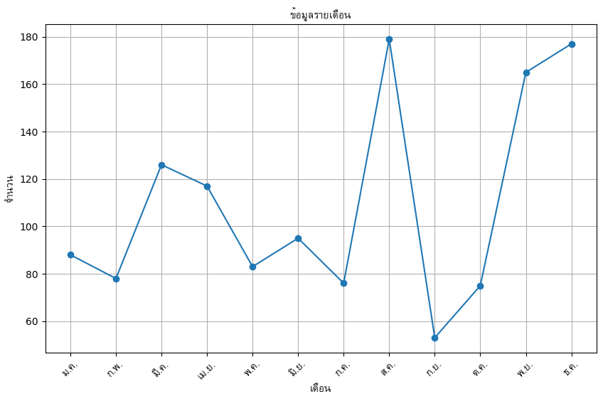

# Run this project in VSCode Dev Container

This project is configured to run in a [VSCode Dev Container](https://code.visualstudio.com/docs/remote/containers). This is a great way to ensure that everyone is using the same development environment.

## Run Sevice

```bash

fastapi dev

```

## Open Swagger UI

Open your browser and navigate to [http://localhost:8000/docs](http://localhost:8000/docs)

## Output

